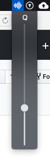

# MonitorControl.OSX
A simple menulet to control your external monitors volume over HDMI.
Be aware that this has only been tested with *one* external screen. Might behave funny with multiple screens ;-) 

Precompiled binary, ready to use:
[Download](application/MonitorControlOSX.dmg)

Original version:

Compatible with most Dell monitors and LG including 27UD68

---

Powered by [@kfix/ddcctl](https://github.com/kfix/ddcctl)
